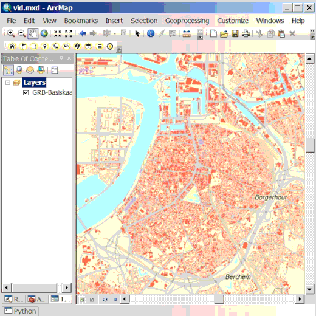

GIPOD
=====

  Dit is een tool om [GIPOD](http://www.agiv.be/gis/diensten/?catid=158) data te importeren. Via [Hinder op kaart](http://www.geopunt.be/hinder-in-kaart) of de [publieke webservice](http://gipod.api.agiv.be/) kan iedereen de GIPOD-data raadplegen. Deze tool gaat deze data ophalen via de publieke webservice voor gebruik in analyses en cartografie. 

Selecteer eerst of je manifestaties of werkopdrachten wilt doorzoeken.
Je kunt kiezen uit verschillende filter opties, selecteer een waarde uit de keuzelijst:

- Provincie
- Stad (moet binnen de provincie liggen)
- Eigenaar
- Type manifestatie (enkel bij manifestaties)
- Startdatum (mininaal huidige datum)
- Einddatum (altijd groter dan startdatum)
- Je kunt beperken tot huidig zoomniveau.

Je kunt opslaan naar Shapefile of in een File Geodatabase, die wordt toegevoegd aan de kaart.

<!--  -->

####Wat is GIPOD

Het GIPOD biedt een centraal platform om informatie over wegenwerken, manifestaties en andere activiteiten op het openbare domein op voorhand in te geven en te beheren. Op die manier is de hinder vooraf gekend, kunnen werken op elkaar worden afgestemd en kan voor omleidingen worden gezorgd. Bedoeling is de overlast op de openbare weg tot een minimum te beperken.  GIPOD is een initiatief van de Vlaamse Overheid, in beheer in bij het Agentschap voor Geografische Informatie Vlaanderen (AGIV).
